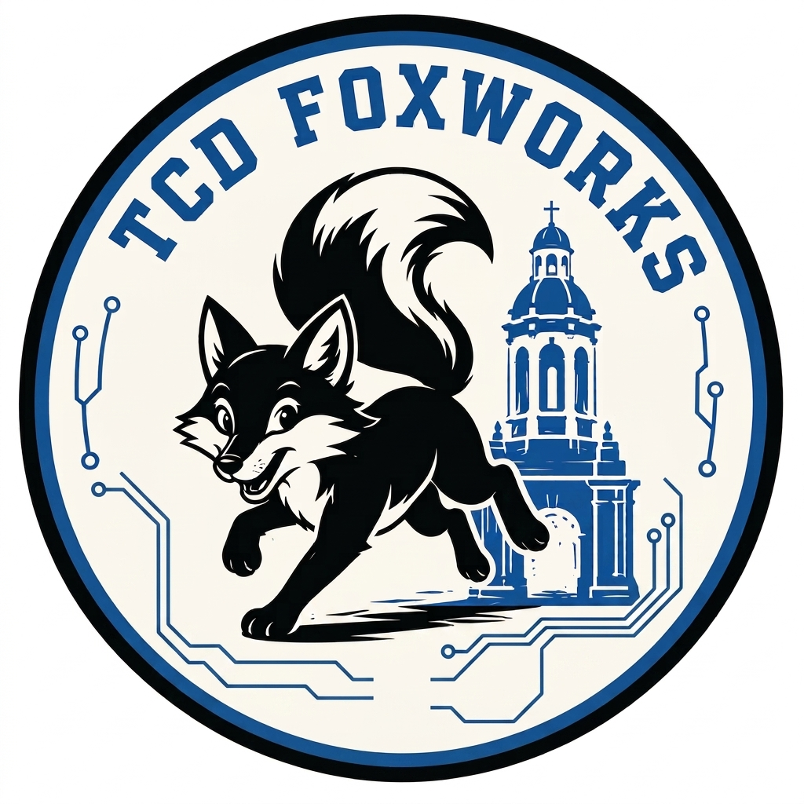

   

# TCD Foxworks PicoRV32

- [Read the documentation for project](docs/info.md)

## Harden locally

NOTE: Tiny Tapeout's [GitHub Actions](https://github.com/mjvf/ttsky-tcd-foxworks-picorv32/actions) will *automatically* harden the design and prepare GDS every time the new changes are committed to the repository.

To harden locally read about the setup:
https://www.tinytapeout.com/guides/local-hardening/

  
### What is Tiny Tapeout?

Tiny Tapeout is an educational project that aims to make it easier and cheaper than ever to get your digital and analog designs manufactured on a real chip.
To learn more and get started, visit https://tinytapeout.com.
- [FAQ](https://tinytapeout.com/faq/)
- [Join the community](https://tinytapeout.com/discord)
